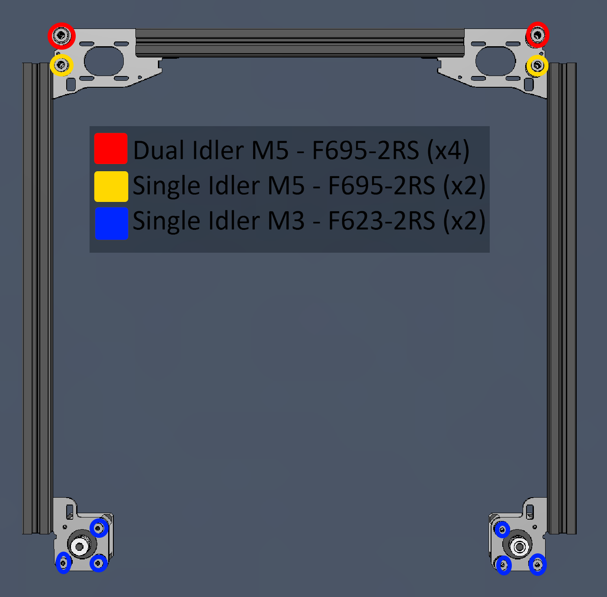
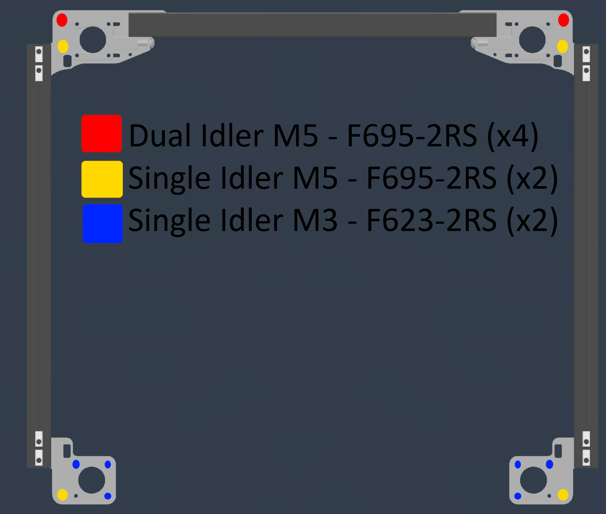

---
hide:
  - navigation
---
# Setup and Configuration

## NEMA14 Bearing Idler Stacks

## NEMA17 Bearing Idler Stacks

These are also the idler locations for the original NEMA14 (and Funssor CNC plates) plates.

## AWD Belt Pathing

The belt pathing for AWD is swapped compared to a stock v2.4. This is to keep compatibility with stock and aftermarket XY-joints. 

 * Your A Stepper (Back-Right) will be on the lower belt and the B Stepper (Back-Left) will be on the upper belt. 
 * This means the Front-Left Stepper will be on the lower belt and the Front-Right Stepper will be on the upper belt.

## 2WD Belt Pathing

The belt path is identical to the stock voron path for a 2WD setup.

## Configuration in Klipper

### Changes needed

* Config in Klipper is straight-forward as you're just adding an additional stepper for X and Y. I named them `Stepper_X1` and `Stepper_Y1`. Very creative, I know.

* Be sure to test your config by doing a `STEPPER_BUZZ STEPPER={namegoeshere}` to verify they are moving the correct way. More info in the [Klipper Docs](https://www.klipper3d.org/Config_checks.html#verify-stepper-motors).

* Carefully test to determine how much of an exclusion zone you'll need to set in your slicer for each of the front corners if using AWD.

### Config Reference

* The configuration for the test printer with AWD can be found in my backup repo here: [config/steppers_xy.cfg](https://github.com/aTinyShellScript/AWDoom_Klipper_Backup/blob/master/config/steppers_xy.cfg)

## Slicer Configuration

* PrusaSlicer and SuperSlicer can be configured with custom bed shapes to allow for the bed exclusion zones at the front corners.
* These custom bed shapes are done with an STL. If you need assistance with this, message me on Discord. Info on the [Contact](/contact) page.