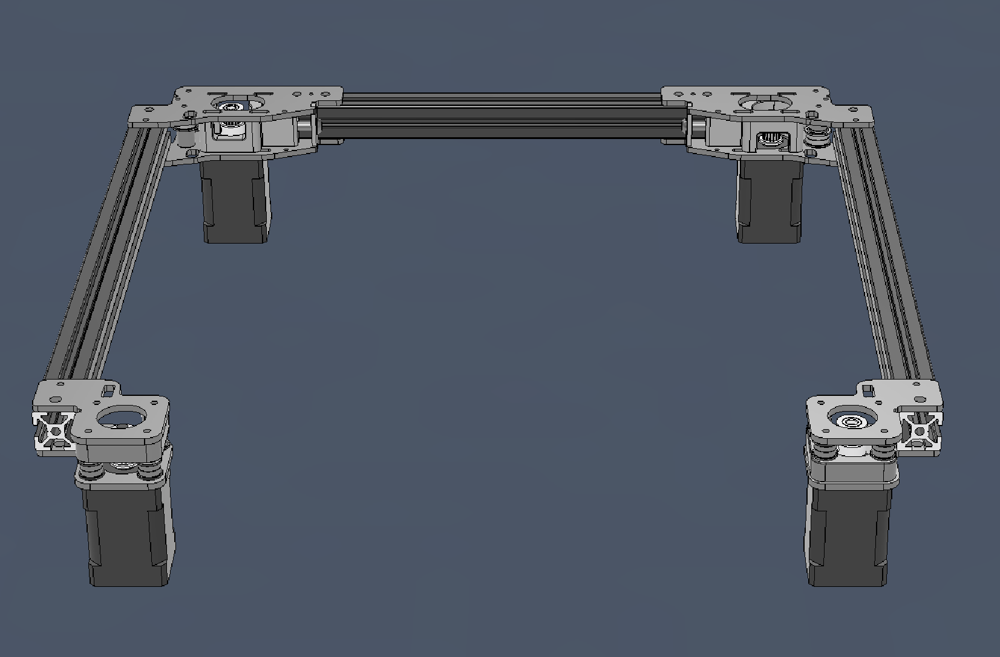

# A Voron v2.4 AWD Mod

<iframe width="560" height="315" src="https://www.youtube-nocookie.com/embed/Lp676hJnY2M?start=8" title="YouTube video player" frameborder="0" allow="accelerometer; autoplay; clipboard-write; encrypted-media; gyroscope; picture-in-picture; web-share" allowfullscreen></iframe>

## Getting Started

So you're thinking about burning some money? 

Decide what size steppers you want to use (NEMA14 recommended) and select [Metal](/metal_parts) or [Printed](/printed_parts) from the menu up top.

### But Why?

* Pros
    * You will be able to print faster with less vibration.
        * Having two steppers per belt helps equalizes the stretching that can happen.
    * Metal (if you go metal) plates help dissipate heat from your steppers, so you can run much higher currents.
    * For 2WD, you can get rid of those stupid front tensioners that break.
    * Looks cool. Bling is always a good thing.
    * Works with existing XYjoints.
* Cons
    * If modifying an existing printer (or building from BOM or a Kit) you will lose a small amount of bed space.
        * For NEMA14s, you will lose between 15x15mm and 30x30mm of space, depending on the toolhead you use.
        * For NEMA17s, you can expect to lose betweeen 25x25 and 40x40mm of space.
        * For 2WD, you lose no space.
    * Cost

## Still Have Questions?

You can find discussion about this mod in the [Armchair Engineering Discord](https://discord.gg/armchairengineeringsux). There is a thread in `user-projects`.
