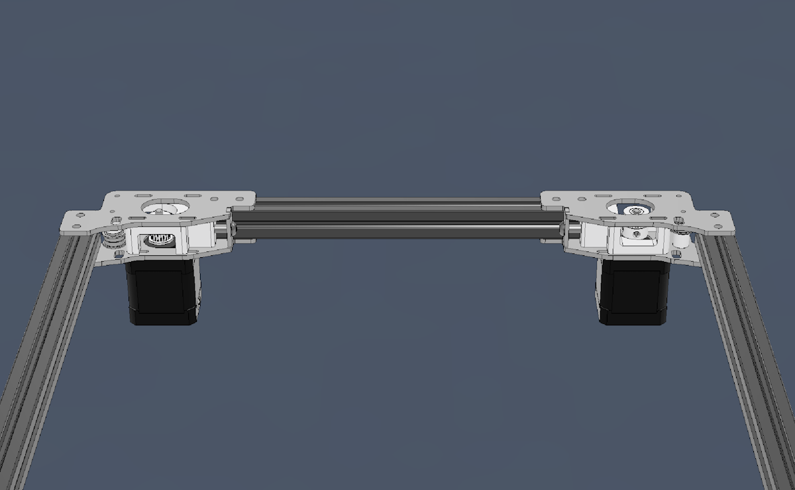

---
hide:
  - navigation
---
# Metal ABAB Drives

## Non-Metal Parts
Some bits still have to be printed.

* The printed parts are listed in the STL directory of the GitHub repo under either [STL/NEMA14/MetalPlates](https://github.com/aTinyShellScript/v2.4_AWD/tree/main/STLs/NEMA14/MetalPlates) or [STL/NEMA17/MetalPlates](https://github.com/aTinyShellScript/v2.4_AWD/tree/main/STLs/NEMA17/MetalPlates) depending on your stepper size. 
* If your Rear Plates aren't all identical, you'll need to print the 'v1 Plate' parts in the MetalPlates folder.
* For 2WD, you do not need the 'FrontMidBody' parts but you need two additional '10mmSpacer'. 
    * Unless using [DoubleT pins](https://www.aliexpress.us/item/3256805681511344.html).

## All Wheel Drive
The NEMA14 and NEMA17 versions largely have the same BOM but they're broken out here for visibility.

### NEMA14 BOM
Please note that the original NEMA14 plates (and Funssor CNC plates) will require 4 extra F695-2RS Bearings and 2 extra M3x20 standoffs.

    * 12x F695-2RS Bearings
    * 12x F623-2RS Bearings
    * 2x M5x30mm
    * 2x M5 Nuts
    * 4x 20mm M3 Metal Standoffs (or DoubleT pins)
    * 12x M3x8mm
    * 16x M3x30mm

### NEMA17 BOM
    * 16x F695-2RS Bearings
    * 12x F623-2RS Bearings
    * 2x M5x30mm
    * 2x M5 Nuts
    * 6x 20mm M3 Metal Standoffs (or DoubleT pins)
    * 12x M3x8mm
    * 16x M3x30mm

### Assembly

Use the CAD for info on how to assemble.

## Two Wheel Drive
* Even without adding two extra steppers, you can gain benefits from using metal plates for your AB drives due to increased rigidity and added heatsinking for the stepper.
  
* There are printable Simple Idlers located in the `Printed` sub-folder if you aren't concerned about chamber temps.

### BOM
    * 16x F695-2RS Bearings
    * 2x M5x30mm
    * 2x M5 Nuts
    * 6x 20mm M3 Metal Standoffs (or DoubleT pins)
    * 12x M3x8mm
    * 8x M3x30mm

### Assembly
2WD setups need to keep the stock Voron belt path and not the flipped belt path of the AWD version that is shown in the CAD. See the image below for the correct orientation of the pulleys and tensioner parts.

Use the CAD for info on how to assemble.