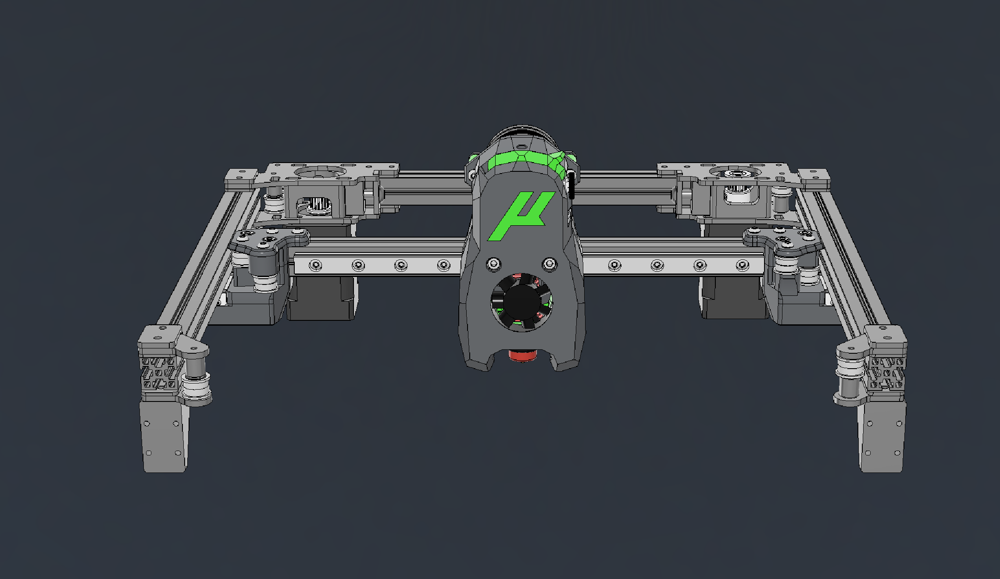

---
hide:
  - navigation
---

# Micron Metal AB Drives
Consider these in BETA and not thouroughly tested. So still get cut at your own risk.

An offshoot of the AWD plates, this is just a shrunk down version to allow higher current to be run on Microns.

You can find the repo here: [https://github.com/aTinyShellScript/metal_micron](https://github.com/aTinyShellScript/metal_micron)

## Printed Parts
You need to print all the bits in the root of the STL folder.

If you want to try out the Rigid Z Carriages:
- They are in the Optional folder in the STL folder.
- You'll need 8x M3x16 bolts and 8x M3 washers.

If you want to use the stock micron z-carriages:
- Print 8x of the 'Z_Tension_Clamps'.

## Metal Parts

The tested version of the mod uses 0.100"/2.54mm thick 5052 plates for most parts and 0.059"/1.5mm thick steel for the spacers. Steel was used since it was the only option for 1.5mm thickness.
- Saved Carts on SendCutSend for both the Tapped and Untapped versions are on the [Sourcing] page.
  - Tapped will require you to tap 12 m3 holes. Two in each AB plate and 1 in each idler.
  - Untapped will require a nylock nut to retain the bearing bolts.
- DXFs are available [here](https://github.com/aTinyShellScript/metal_micron/blob/main/DXF) if you want to use another manufacturer or cut them yourself.

## BOM
    * 2x M5x20mm
    * 2x M5 Nuts
    * 14x M3x30mm
    * 24x M3x12mm
    * All stock bearings and shims

## Untapped BOM additions
    * 6x M3 Nuts (nylok)

## Assembly

Coming Soon™ (Nah, just look at the CAD)